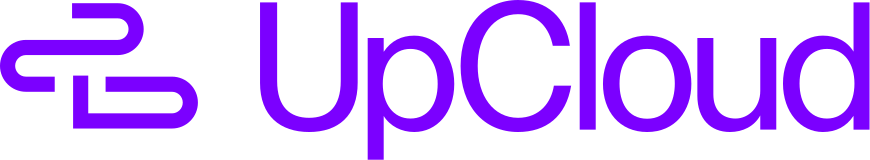

<p align="center">
  <a href="https://upcloud.com/">
    
  </a>
</p>

# upcloud-operator

Sponsored by [UpCloud](https://upcloud.com/), who provided infrastructure credits and funded real-API end-to-end testing for this project.

A Kubernetes operator for UpCloud hosted products. It exposes namespaced
CRDs for SDN networks and routers, network gateways, Managed Databases,
Managed Object Storage, and Load Balancers, and keeps every UpCloud
resource in sync with its Custom Resource.

## Kinds

Twenty-five kinds across four API groups. See
[docs/resources.md](docs/resources.md) for the full table: what each kind
maps to, where its UpCloud identity lands, and which Secrets the operator
produces.

| Group | Kinds |
|---|---|
| `network.upcloud.polarsquad.com` | Network, Router, Gateway, GatewayConnection, GatewayTunnel, NetworkPeering, FloatingIP |
| `database.upcloud.polarsquad.com` | ManagedDatabase, ManagedDatabaseUser, ManagedDatabaseLogicalDatabase |
| `objectstorage.upcloud.polarsquad.com` | ManagedObjectStorage, ObjectStoragePolicy, ObjectStorageUser, ObjectStorageAccessKey, ObjectStorageBucket, ObjectStorageCustomDomain |
| `loadbalancer.upcloud.polarsquad.com` | LoadBalancer, LoadBalancerBackend, LoadBalancerBackendMember, LoadBalancerBackendTLSConfig, LoadBalancerResolver, LoadBalancerFrontend, LoadBalancerFrontendRule, LoadBalancerFrontendTLSConfig, LoadBalancerCertificateBundle |

## Install

Apply the release manifests (CRDs plus the operator Deployment):

```sh
kubectl apply -f https://github.com/polarsquad/upcloud-operator/releases/latest/download/install.yaml
```

### Verify the image signature

The release workflow signs the multi-arch image keylessly (GitHub OIDC +
Sigstore). Verify before you trust it. The certificate identity embeds
the ref the image was built from, so include `@refs/tags/<tag>`:

```sh
cosign verify ghcr.io/polarsquad/upcloud-operator:<tag> \
  --certificate-identity "https://github.com/polarsquad/upcloud-operator/.github/workflows/release.yml@refs/tags/<tag>" \
  --certificate-oidc-issuer https://token.actions.githubusercontent.com
```

### Credentials

Create the credentials Secret in the operator namespace. The manager
exits at startup when no credential is set.

```sh
kubectl create secret generic upcloud-credentials \
  -n upcloud-operator-system \
  --from-literal=UPCLOUD_TOKEN=***
```

`UPCLOUD_USERNAME` and `UPCLOUD_PASSWORD` are accepted instead of
`UPCLOUD_TOKEN`.

Scope the token to the minimum permissions your workloads need, and
rotate it by replacing the Secret and restarting the Deployment:

```sh
kubectl create secret generic upcloud-credentials \
  -n upcloud-operator-system \
  --from-literal=UPCLOUD_TOKEN=*** \
  --dry-run=client -o yaml | kubectl apply -f -
kubectl rollout restart deployment controller-manager -n upcloud-operator-system
```

## Example: a full chain

A Router, a private Network, a PostgreSQL database attached to that
network, and a database user. The last kind makes the operator write a
Secret that your pods consume directly.

```yaml
apiVersion: network.upcloud.polarsquad.com/v1alpha1
kind: Router
metadata:
  name: app-router
spec:
  name: app-router
---
apiVersion: network.upcloud.polarsquad.com/v1alpha1
kind: Network
metadata:
  name: app-network
spec:
  name: app-network
  zone: fi-hel1
  ipNetworks:
    - address: 10.100.0.0/16
      family: IPv4
      dhcp: true
  routerRef:
    name: app-router
---
apiVersion: database.upcloud.polarsquad.com/v1alpha1
kind: ManagedDatabase
metadata:
  name: app-db
spec:
  type: pg
  plan: 1x1xCPU-2GB-25GB
  zone: fi-hel1
  properties:
    version: "16"
  networks:
    - name: private
      type: private
      networkRef:
        name: app-network
---
apiVersion: database.upcloud.polarsquad.com/v1alpha1
kind: ManagedDatabaseUser
metadata:
  name: app-db-user
spec:
  serviceRef:
    name: app-db
  username: app
```

Wait until `app-db-user` is Ready, then the operator has written the
`app-db-user-credentials` Secret. A pod consumes it with no passwords in
its manifest:

```yaml
apiVersion: v1
kind: Pod
metadata:
  name: app
spec:
  containers:
    - name: app
      image: your-image
      envFrom:
        - secretRef:
            name: app-db-user-credentials
      env:
        - name: DATABASE_URI
          valueFrom:
            secretKeyRef:
              name: app-db-user-credentials
              key: uri
```

Every example in [config/samples/](config/samples/) applies the same way:
`kubectl apply -f config/samples/<file> -n <namespace>`.

## Deletion policy

Each kind has `spec.deletionPolicy`: `Delete` (default) or `Orphan`.

- `Delete`: deleting the CR removes the UpCloud resource. Deletion is
  blocked (the CR stays with a `Deleting` condition) while UpCloud
  refuses: a Router with attached networks, a Gateway with connections,
  a LoadBalancer with any children, a ManagedObjectStorage with buckets,
  and so on. Delete the children first, or delete the whole namespace.
- `Orphan`: deleting the CR removes only the Custom Resource; the
  UpCloud resource keeps running.

## Manager flags

Run `kubectl edit deployment controller-manager -n upcloud-operator-system`
to adjust:

- `--leader-elect` (default false): run multiple replicas with
  leader election.
- `--steady-requeue` (default 5m): how often Ready objects are
  re-checked for drift against UpCloud. Raise it on accounts with many
  resources, lower it if you want drift caught sooner.

## Verification and testing

The operator is validated across three tiers:

- **Unit and adapter tests**: Every controller and adapter runs unit tests
  against an in-memory fake API (`internal/upcloudapi/fake/`). Tests verify
  resource creation, drift reconciliation, status observation, error handling,
  and deletion idempotency without making calls to live services.
- **Kind smoke tests (`test/e2e/`)**: Runs in GitHub Actions on every pull
  request and push to `main`. Deploys the controller manager to a local KinD
  cluster to verify controller startup, leader election, RBAC bindings,
  and Prometheus metrics under the Kubernetes restricted pod security profile.
- **Real UpCloud API end-to-end suite (`test/e2e-upcloud/`)**: Validated
  against live UpCloud infrastructure in `fi-hel1` (gated behind GitHub
  Actions `workflow_dispatch` on the `upcloud-e2e` environment with real API
  credentials funded by UpCloud). The suite provisions a full multi-product
  resource chain:
  - SDN Router and private Network with DHCP
  - Floating IP allocation
  - Managed Object Storage service, S3 IAM User, S3 Policy document, and
    S3 Access Key
  - Managed PostgreSQL Database
  - Verifies automatic Kubernetes Secret creation for S3 access credentials
    and database connection URI
  - Verifies teardown: reverse-dependency deletion driven by Kubernetes
    finalizers, followed by UpCloud API verification confirming all resources
    return 404

## Known limitations (v0.1)

- **Token at rest.** UpCloud offers no OIDC federation, so the operator
  credential is a Secret. Scope it tightly; per-namespace credentials
  are the first planned follow-up.
- **Database plan naming.** Plan names are componentised shapes
  (`<nodes>x<cpu>xCPU-<ram>-<storage>`, for example `1x1xCPU-2GB-25GB`).
  Query `GET /1.3/database/plans` for currently offered shapes per zone.
- **Free-form database `properties`.** Validated by UpCloud at request
  time, so a typo surfaces as an `UpdateFailed` condition, not an
  admission error. Typed properties per engine are planned.
- **Object storage policy ARNs.** UpCloud validates policy document
  `Resource` entries against standard S3 ARNs (`arn:aws:s3:::<bucket>`,
  `arn:aws:s3:::<bucket>/*`, or `*`). Custom ARN namespaces are rejected
  with status 400.
- **Undetectable secrets.** Tunnel PSKs and certificate private keys are
  never echoed by the API; rotating the backing Secret does not trigger a
  re-apply on its own. Bump `spec.rotationToken` on a GatewayTunnel or
  LoadBalancerCertificateBundle to force the material to be re-read from
  its Secret (a tunnel is replaced, re-establishing the VPN).
- **No implicit recreation.** Most fields are immutable in UpCloud and
  the CRDs enforce it at admission. The one exception is GatewayTunnel:
  any spec change deletes and recreates the tunnel (the API has no
  tunnel modify), which re-establishes the VPN.
- **Floating IP PTR clearing.** `spec.ptrRecord` can be set, but the
  UpCloud API omits empty values on update. Clearing a PTR record requires
  deleting and recreating the FloatingIP.
- **Adoption.** Networks, Routers, Gateways, Managed Databases, Managed
  Object Storage and Network Peerings are adopted by the `services.k8s.upcloud/uid` label.
  Children (users, access keys, buckets, policies, custom domains,
  LoadBalancer children) have no API labels and are matched by `(parent,
  name)`. FloatingIPs carry no API labels, so there is no adoption: a
  FloatingIP with an empty `status.address` cannot be matched to an existing
  address and is re-allocated.
- **Redis.** Treated as deprecated by the SDK and not in the
  `ManagedDatabase` type enum.

Floating IPs are allocated unbound; attaching one to a server is not part of
v0.1 (the operator does not manage Cloud Servers).

## Docs

- [docs/resources.md](docs/resources.md): every kind, its UpCloud
  counterpart, produced Secrets.
- [docs/development.md](docs/development.md): adding a kind, the local
  loop, and the release procedure.

## License

Apache-2.0
